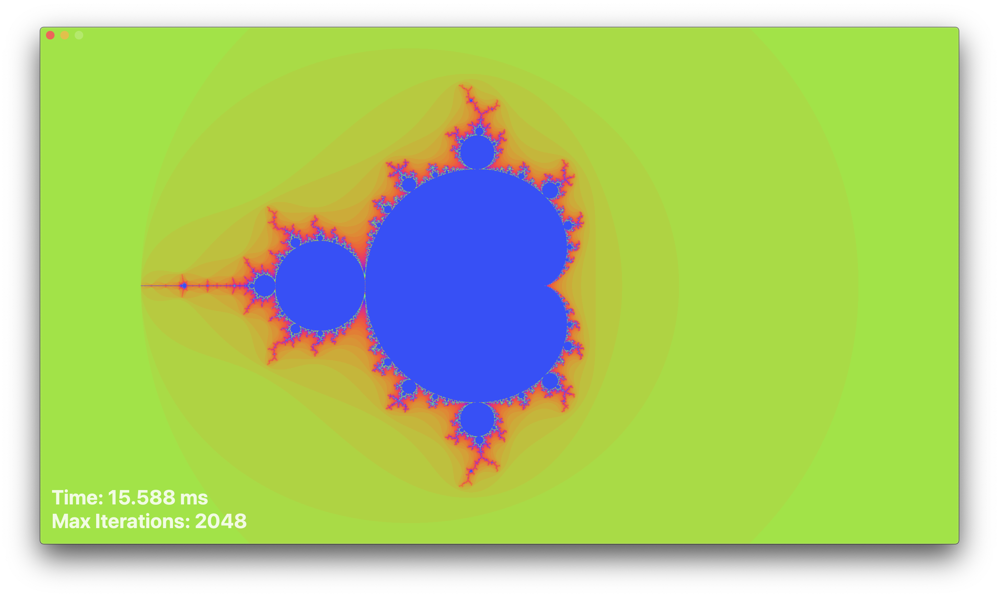
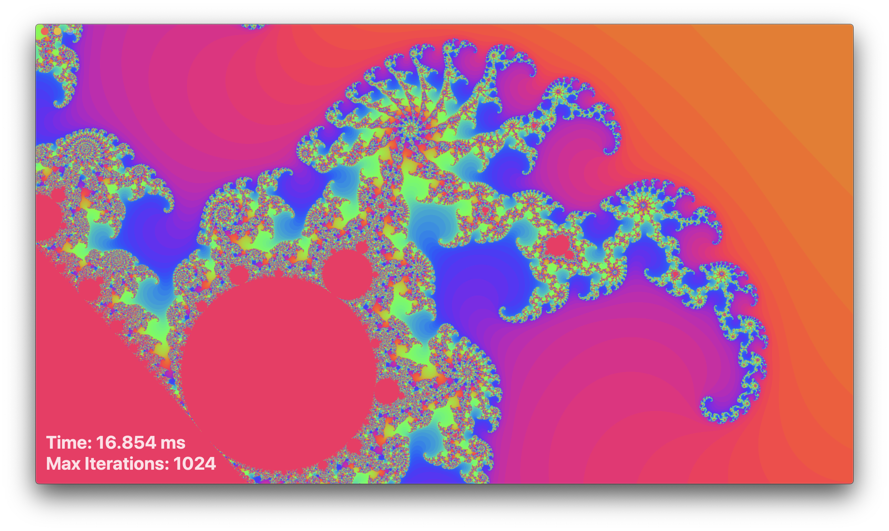
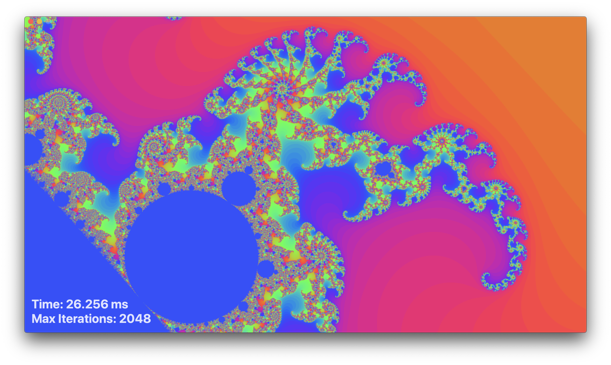

<script type="text/javascript" src="https://cdnjs.cloudflare.com/ajax/libs/mathjax/2.7.0/MathJax.js?config=TeX-AMS_CHTML"></script>
<script type="text/x-mathjax-config">
    MathJax.Hub.Config({
        tex2jax: {
            inlineMath: [['$','$'], ['\\(','\\)']], 
            processEscapes: true
        }, jax: ["input/TeX","input/MathML","input/AsciiMath","output/CommonHTML"],
        extensions: ["tex2jax.js","mml2jax.js","asciimath2jax.js","MathMenu.js","MathZoom.js","AssistiveMML.js", "[Contrib]/a11y/accessibility-menu.js"],
        TeX: {
            extensions: ["AMSmath.js","AMSsymbols.js","noErrors.js","noUndefined.js"],
            equationNumbers: {
                autoNumber: "AMS"
            }
        }
    });
</script>

# Mandelbrot Set:

From Wiki: <br>
&nbsp;&nbsp;&nbsp;&nbsp;The **Mandelbrot set** is the set of complex numbers c for which the function \\( f_c(z) = z^2 + c\\) does not diverge when iterated from \\(z = 0\\), for which the sequence \\(f_c(0), f_c(f_c(0))\\), etc., remains bounded in absoute value.

Pseudocode:
```
for each pixel (Px, Py) on the screen do
    x0 = scaled x coordinate of pixel (scaled to lie in the Mandelbrot X scale (-2.5, 1))
    y0 = scaled y coordinate of pixel (scaled to lie in the Mandelbrot Y scale (-1, 1))
    x := 0.0
    y := 0.0
    iteration := 0
    max_iteration := 1000
    while (x×x + y×y ≤ 2×2 AND iteration < max_iteration) do
        xtemp := x×x - y×y + x0
        y := 2×x×y + y0
        x := xtemp
        iteration := iteration + 1
 
    color := palette[iteration]
    plot(Px, Py, color)
```

## Output:




**[More Screenshots](https://github.com/SaiHemanthBR/PhysicsSims/tree/master/MandelbrotSet/Images)**